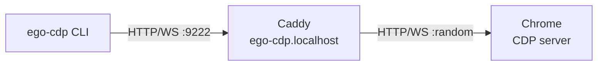

# ego-cdp

A CLI tool to launch and manage a Chrome instance with [Chrome DevTools Protocol](https://chromedevtools.github.io/devtools-protocol/) (CDP) access, fronted by a [Caddy](https://caddyserver.com) reverse proxy.

Designed for use inside sandboxed AI coding agents — the proxy lets CDP traffic flow through an allowed domain (`ego-cdp.localhost`) without breaking out of the sandbox for every command.

Main design philosophy: don't abstract over CDP, let the agent cook. Achieved in ~390 LOC JS and a SKILL.md.

## Prerequisites

- macOS with Google Chrome installed
- [Caddy](https://caddyserver.com) on `PATH`
- Node.js ≥ 22
## Install

```bash
npm install
```

## Usage

### Lifecycle

```bash
# Start Chrome and Caddy reverse proxy
ego-cdp start

# Check status of both processes
ego-cdp status

# Stop Chrome and Caddy
ego-cdp stop
```

`start` picks a random port for CDP, launches Chrome with a dedicated profile (`~/.chrome/Ego`), and starts Caddy to proxy `ego-cdp.localhost:<PORT>` → `localhost:<CDP_PORT>`.

### HTTP commands

Send HTTP requests to CDP endpoints through the proxy:

```bash
# Browser version info
ego-cdp http /json/version

# List open tabs
ego-cdp http /json/list

# Save output to a file
ego-cdp http /json/version --output=version.json
```

### WebSocket commands

Send CDP protocol messages over WebSocket:

```bash
# List all targets (replace <guid> with the browser WebSocket GUID from /json/version)
ego-cdp ws /devtools/browser/<guid> '{"id":1,"method":"Target.getTargets"}'

# Create a new tab
ego-cdp ws /devtools/browser/<guid> '{"id":1,"method":"Target.createTarget","params":{"url":"https://example.com","background":true}}'

# Evaluate JavaScript in a tab (replace <id> with a page target ID)
ego-cdp ws /devtools/page/<id> '{"id":1,"method":"Runtime.evaluate","params":{"expression":"document.title"}}'

# Navigate a tab
ego-cdp ws /devtools/page/<id> '{"id":1,"method":"Page.navigate","params":{"url":"https://example.com"}}'

# Custom timeout (default 60000ms)
ego-cdp ws /devtools/page/<id> '{"id":1,"method":"Runtime.evaluate","params":{"expression":"1+1"}}' --timeout=5000
```

## Configuration

| Variable | Default             | Description                                    |
| -------- | ------------------- | ---------------------------------------------- |
| `HOST`   | `ego-cdp.localhost` | Caddy proxy hostname (must be `*.localhost`)   |
| `PORT`   | `9222`              | Caddy proxy listen port                        |

Chrome user data and runtime files (PID files, Caddy config) are stored in `~/.chrome`.

## Architecture



The indirection through Caddy exists so that sandbox network policies can allowlist a single domain (`ego-cdp.localhost`) rather than requiring unrestricted `localhost` access. The `.localhost` TLD resolves to `127.0.0.1` automatically (RFC 6761). Traffic is routed through the sandbox's HTTP proxy with `noProxy` disabled (see `lib/common/network.js`) to prevent clients from bypassing the proxy for `.localhost` domains.

## pi Integration

ego-cdp is a [pi package](https://github.com/mariozechner/pi-coding-agent) that ships a `browser-use` skill. When installed, pi agents can discover and use Chrome automation capabilities through the skill interface.

```jsonc
// package.json
{
  "keywords": ["pi-package"],
  "pi": {
    "skills": ["./skills"],
  },
}
```

## License

MIT
